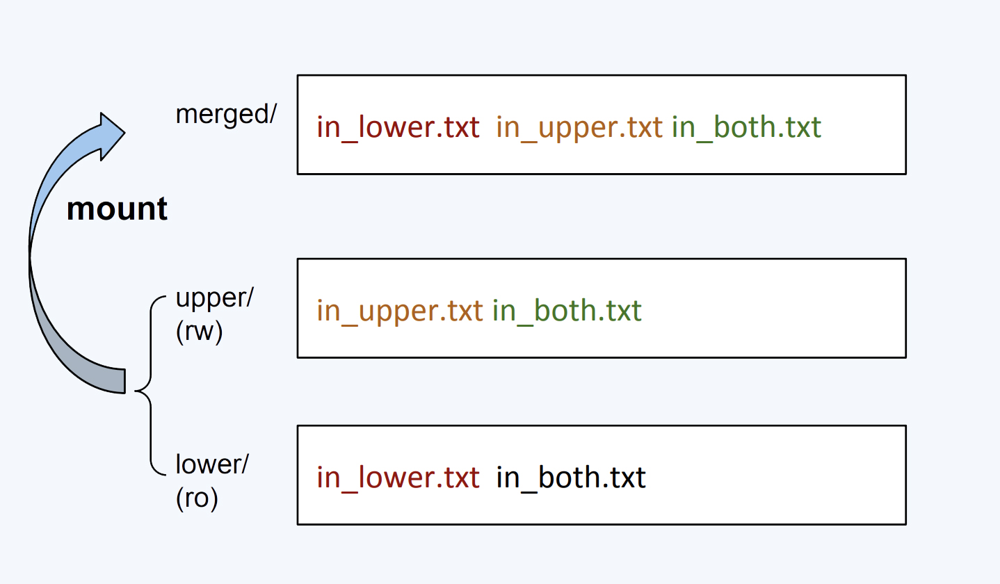
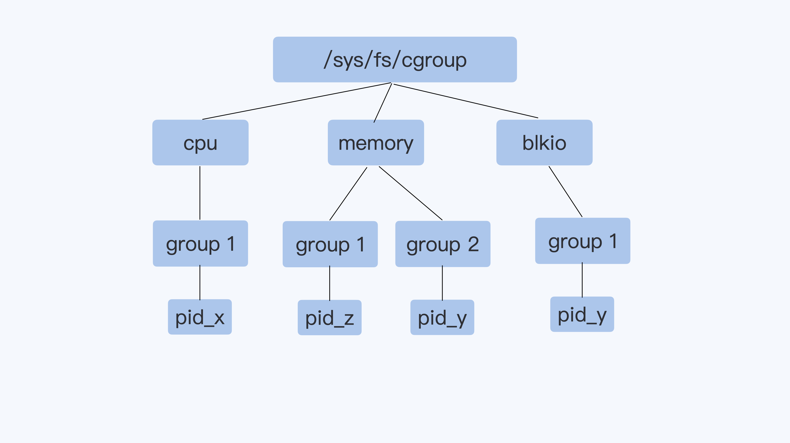
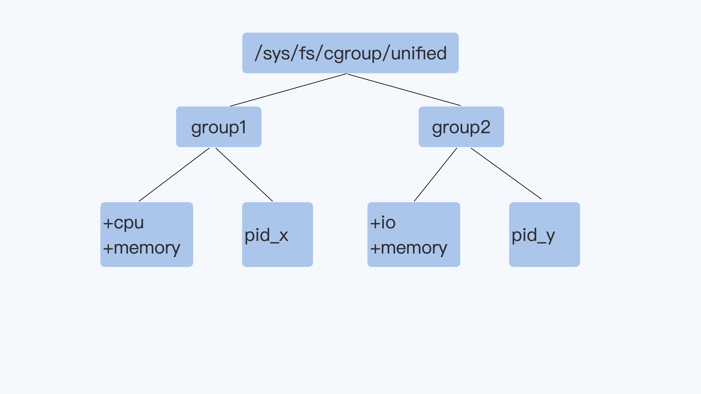

# Docker原理

Docker实质上是一个进程，通过Linux Namespace、Linux Cgroups及rootfs技术实现进程隔离，营造出独立运行环境的错觉。

## 1. Linux Namespace：营造独立环境幻象

- **PID Namespace**：通过`CLONE_NEWPID`参数，使容器内的进程认为自己是系统中的“1号进程”，实则在宿主机上仅是众多进程之一。
- **其他Namespace**：包括Mount、Network、User等，分别隔离文件系统视图、网络设备与配置、用户权限等，实现全面的环境隔离。

例子：Linux创建一个进程时，指定CLONE_NEWPID参数
```
int pid = clone(main_function, stack_size, CLONE_NEWPID | SIGCHLD, NULL); 
```
这时，新创建的这个进程将会“看到”一个全新的进程空间，在这个进程空间里，它的 PID 是 1。

<br>

## 2. Linux CGroups：资源的紧箍咒
虽然docker进程表面上被隔离了起来，但是它所能够使用到的资源（比如CPU、内存），却是可以随时被宿主机上的其他进程（或者其他容器）占用的。
这样它也可能把所有资源吃光，所以要用CGroups进行资源的隔离。

- **资源限制**：CGroups用于约束进程对CPU、内存、磁盘I/O、网络带宽等资源的使用上限。
- **操作接口**：CGroups通过`/sys/fs/cgroup`路径下的文件系统接口进行管理，如调整`cpu.cfs_quota_us`和`cpu.cfs_period_us`来限定CPU使用率。
- **分配比例**：`cpu.shares`设定控制组间CPU资源的相对分配比例，在资源紧张时体现其重要性。
  

在 Linux 中，Cgroups 给用户暴露出来的操作接口是文件系统，即它以文件和目录的方式组织在操作系统的 /sys/fs/cgroup 路径下。
在 Ubuntu 16.04 机器里，我可以用 mount 指令把它们展示出来，这条命令是：
```
$ mount -t cgroup 
cpuset on /sys/fs/cgroup/cpuset type cgroup (rw,nosuid,nodev,noexec,relatime,cpuset)
cpu on /sys/fs/cgroup/cpu type cgroup (rw,nosuid,nodev,noexec,relatime,cpu)
cpuacct on /sys/fs/cgroup/cpuacct type cgroup (rw,nosuid,nodev,noexec,relatime,cpuacct)
blkio on /sys/fs/cgroup/blkio type cgroup (rw,nosuid,nodev,noexec,relatime,blkio)
memory on /sys/fs/cgroup/memory type cgroup (rw,nosuid,nodev,noexec,relatime,memory)
...
```
可以看到，在 /sys/fs/cgroup 下面有很多诸如 cpuset、cpu、 memory 这样的子目录，也叫子系统。这些都是我这台机器当前可以被 Cgroups 进行限制的资源种类。
如果看不到这些文件路径，就要自己去挂载。
```
$ ls /sys/fs/cgroup/cpu
cgroup.clone_children cpu.cfs_period_us cpu.rt_period_us  cpu.shares notify_on_release
cgroup.procs      cpu.cfs_quota_us  cpu.rt_runtime_us cpu.stat  tasks
```
如果熟悉 Linux CPU 管理的话，你就会在它的输出里注意到 cfs_period 和 cfs_quota 这样的关键词。
这两个参数需要组合使用，可以用来限制进程在长度为 cfs_period 的一段时间内，只能被分配到总量为 cfs_quota 的 CPU 时间。

如何使用Cgroup?
我们现在进入 /sys/fs/cgroup/cpu 目录下：
```
root@ubuntu:/sys/fs/cgroup/cpu$ mkdir container
root@ubuntu:/sys/fs/cgroup/cpu$ ls container/
cgroup.clone_children cpu.cfs_period_us cpu.rt_period_us  cpu.shares notify_on_release
cgroup.procs      cpu.cfs_quota_us  cpu.rt_runtime_us cpu.stat  tasks
```
这个目录就称为一个“控制组”。你会发现，操作系统会在你新创建的 container 目录下，自动生成该子系统对应的资源限制文件。

我们可以通过查看 container 目录下的文件，看到 container 控制组里的 CPU quota 还没有任何限制（即：-1），CPU period 则是默认的 100  ms（100000  us）：
```
$ cat /sys/fs/cgroup/cpu/container/cpu.cfs_quota_us -1
$ cat /sys/fs/cgroup/cpu/container/cpu.cfs_period_us 100000
```
接下来，我们可以通过修改这些文件的内容来设置限制。比如，向 container 组里的 cfs_quota 文件写入 20  ms（20000  us）：
```
$ echo 20000 > /sys/fs/cgroup/cpu/container/cpu.cfs_quota_us
```
它意味着在每 100  ms 的时间里，被该控制组限制的进程只能使用 20  ms 的 CPU 时间，也就是说这个进程只能使用到20 / 100 = 20% 的 CPU 带宽。
接下来，我们把被限制的进程的 PID 写入 container 组里的 tasks 文件，上面的设置就会对该进程生效了：
```
$ echo 226 > /sys/fs/cgroup/cpu/container/tasks 
226进行是一个死循环
$ while : ; do : ; done &
[1] 226
```

还有一个参数cpu.shares。这个值是 CPU  Cgroup 对于控制组之间的 CPU 分配比例，它的缺省值是 1024。假设我们前面创建的 group3 中的 cpu.shares 是 1024，而 group4 中的 cpu.shares 是 3072，那么 group3:group4=1:3。

总结一下：cpu.cfs_quota_us 和 cpu.cfs_period_us 这两个值决定了每个控制组中所有进程的可使用 CPU 资源的最大值；cpu.shares 这个值决定了 CPU Cgroup 子系统下控制组可用 CPU 的相对比例，不过只有当系统上 CPU 完全被占满的时候，这个比例才会在各个控制组间起作用。

Linux Cgroups 的设计还是比较易用的，简单粗暴地理解呢，它就是一个子系统目录加上一组资源限制文件的组合。而对于 Docker 等 Linux 容器项目来说，它们只需要在每个子系统下面，为每个容器创建一个控制组（即创建一个新目录），然后在启动容器进程之后，把这个进程的 PID 填写到对应控制组的 tasks 文件中就可以了。
这也就是
```
$ docker run -it --cpu-period=100000 --cpu-quota=20000 ubuntu /bin/bash
```
的原理了。

<br>

## 3. Rootfs：定制化文件系统
即容器里的应用进程，应当看到一份完全独立的文件系统。

- **Mount Namespace**：允许容器进程拥有独立的文件系统视图，通过chroot或更现代的Mount Namespace技术实现。
- **容器镜像**：基于UnionFS，如OverlayFS，实现分层存储，每个层为增量rootfs，联合挂载形成最终的运行环境，确保一致性和高效存储。

Mount Namespace 跟其他 Namespace 的使用略有不同的地方：它对容器进程视图的改变，一定是伴随着挂载操作（mount）才能生效。
我们可以在容器进程启动之前重新挂载它的整个根目录“/”。而由于 Mount Namespace 的存在，这个挂载对宿主机不可见，所以容器进程就可以在里面随便折腾了。
在 Linux 操作系统里，有一个名为 chroot 的命令可以帮助你在 shell 中方便地完成这个工作。
顾名思义，它的作用就是帮你“change root file system”，即改变进程的根目录到你指定的位置。

例子：
首先，创建一个 test 目录和几个 lib 文件夹：
```
$ mkdir -p $HOME/test
$ mkdir -p $HOME/test/{bin,lib64,lib}
$ cd $T
```
然后，把 bash 命令拷贝到 test 目录对应的 bin 路径下：
```
$ cp -v /bin/{bash,ls} $HOME/test/bin
```
接下来，把 bash 命令需要的所有 so 文件，也拷贝到 test 目录对应的 lib 路径下。找到 so 文件可以用 ldd 命令：
```
$ T=$HOME/test
$ list="$(ldd /bin/ls | egrep -o '/lib.*\.[0-9]')"
$ for i in $list; do cp -v "$i" "${T}${i}"; done
```
最后，执行 chroot 命令，告诉操作系统，我们将使用 $HOME/test 目录作为 /bin/bash 进程的根目录：
```
$ chroot $HOME/test /bin/bash
```
这时，你如果执行 "ls /"，就会看到，它返回的都是 $HOME/test 目录下面的内容，而不是宿主机的内容。
更重要的是，对于被 chroot 的进程来说，它并不会感受到自己的根目录已经被“修改”成 $HOME/test 了。

Mount Namespace 正是基于对 chroot 的不断改良才被发明出来的，它是 Linux 操作系统里的第一个 Namespace。
而这个挂载在容器根目录上、用来为容器进程提供隔离后执行环境的文件系统，就是所谓的“容器镜像”。它还有一个更为专业的名字，叫作：rootfs（根文件系统）。
需要明确的是，rootfs只是一个操作系统所包含的文件、配置和目录，并不包括操作系统内核。
在 Linux 操作系统中，这两部分是分开存放的，操作系统只有在开机启动时才会加载指定版本的内核镜像。

由于 rootfs 里打包的不只是应用，而是整个操作系统的文件和目录，也就意味着，应用以及它运行所需要的所有依赖，都被封装在了一起。
有了容器镜像“打包操作系统”的能力，这个最基础的依赖环境也终于变成了应用沙盒的一部分。
这就赋予了容器所谓的一致性：无论在本地、云端，还是在一台任何地方的机器上，用户只需要解压打包好的容器镜像，那么这个应用运行所需要的完整的执行环境就被重现出来了。
这种深入到操作系统级别的运行环境一致性，打通了应用在本地开发和远端执行环境之间难以逾越的鸿沟。

我们在容器里，运行 df 命令，你可以看到在容器中根目录 (/) 的文件系统类型是"overlay"，它不是我们在普通 Linux 节点上看到的 Ext4 或者 XFS 之类常见的文件系统。
Docker 在镜像的设计中，引入了层（layer）的概念：用户制作镜像的每一步操作，都会生成一个层，也就是一个增量 rootfs。
这个想法的原理是Union File System 也叫 UnionFS，最主要的功能是将多个不同位置的目录联合挂载（union mount）到同一个目录下。
```
$ tree
.
├── A
│  ├── a
│  └── x
└── B
  ├── b
  └── x

$ mkdir C
$ mount -t aufs -o dirs=./A:./B none ./C

$ tree ./C
./C
├── a
├── b
└── x
```

这个所谓的“镜像”，实际上就是一个 Ubuntu 操作系统的 rootfs，它的内容是 Ubuntu 操作系统的所有文件和目录。
与之前我们讲述的 rootfs 稍微不同的是，Docker 镜像使用的 rootfs，往往由多个“层”组成：
```
$ docker image inspect ubuntu:latest
...
     "RootFS": {
      "Type": "layers",
      "Layers": [
        "sha256:f49017d4d5ce9c0f544c...",
        "sha256:8f2b771487e9d6354080...",
        "sha256:ccd4d61916aaa2159429...",
        "sha256:c01d74f99de40e097c73...",
        "sha256:268a067217b5fe78e000..."
      ]
    }
```
可以看到，这个 Ubuntu 镜像，实际上由五个层组成。这五个层就是五个增量 rootfs，每一层都是 Ubuntu 操作系统文件与目录的一部分；
而在使用镜像时，Docker 会把这些增量联合挂载在一个统一的挂载点上（等价于前面例子里的“/C”目录）。

容器镜像文件可以分成多个层（layer），每层可以对应 OverlayFS 里 lowerdir 的一个目录，lowerdir 支持多个目录，也就可以支持多层的镜像文件。
在容器启动后，对镜像文件中修改就会被保存在 upperdir 里了。从挂载点的视角看，upper 层的文件会覆盖 lower 层的文件。
减少相同镜像文件在同一个节点上的数据冗余，可以节省磁盘空间，也可以减少镜像文件下载占用的网络资源。



从宿主机的角度看，upperdir 就是一个目录，如果容器不断往容器文件系统中写入数据，实际上就是往宿主机的磁盘上写数据，这些数据也就存在于宿主机的磁盘目录中。
当然对于容器来说，如果有大量的写操作是不建议写入容器文件系统的，一般是需要给容器挂载一个volume，用来满足大量的文件读写。

一些场景下，如果需要限制容器磁盘（其实也就是宿主机磁盘）的写入量，
我们在用 docker run 启动容器的时候，加上一个参数 `--storage-opt size= <SIZE>` ，就能限制住容器 OverlayFS 文件系统可写入的最大数据量了。
实际上就是对 OverlayFS 的 upperdir 目录做 XFS Quota 的限流。对于 Linux 上最常用的两个文件系统 XFS 和 ext4，它们都有特性 Quota。
这个我们可以根据 /proc/mounts 中容器的 OverlayFS Mount 信息，再结合 Docker 的代码，就可以知道限制的目录是"/var/lib/docker/overlay2/<docker_id>"。
那这个目录下有什么呢？upperdir 目录中所有对应的"diff"目录，就在里面！

<br>

## 4. 概念解析

- **容器结构**：一个正在运行的 Linux 容器，其实可以被“一分为二”地看待：
一组联合挂载在 /var/lib/docker/aufs/mnt 上的 rootfs，这一部分我们称为“容器镜像”（Container Image），是容器的静态视图；
一个由 Namespace+Cgroups 构成的隔离环境，这一部分我们称为“容器运行时”（Container Runtime），是容器的动态视图。
- **编排价值**：容器本身没有价值，有价值的是“容器编排”。 Kubernetes 项目所擅长的，是按照用户的意愿和整个系统的规则，完全自动化地处理好容器之间的各种关系。
这种功能，就是我们经常听到的一个概念：编排。

<br>

### 5. 容器对进程数量的限制

在容器创建后，系统会在 `/sys/fs/cgroup/pids` 下生成一个控制组目录，其中的关键文件是 `pids.max`。通过向此文件写入数值，可以设定该容器允许的最大进程数。此外，`pids.current` 显示当前控制组及其所有子孙中进程的总数。

### 6. 容器中init进程退出

当容器的init进程终止时，其内部的所有其他进程也将立即终止。区别在于，init进程接收到的是 `SIGTERM` 信号，而其他进程则收到 `SIGKILL` 信号。

<br>

### 7. 容器中`top`命令的CPU使用率解析

在容器内执行 `top` 命令，尽管能看到各进程的CPU使用率，但`%Cpu(s)` 行显示的是宿主机而非容器的总体CPU使用率。若显示为100%，意味着该进程占用了一个CPU核心；若为200%，则占用了两个核心。
`top` 从 `/proc/[pid]/stat` 文件获取进程状态信息，包括utime（用户态CPU时间）和stime（内核态CPU时间）。
这两个值累加自进程启动，单位基于系统时钟中断（ticks），可通过 `getconf CLK_TCK` 查看每秒ticks数。

计算CPU使用率的公式大致为：

$$
\text{进程CPU使用率} = \frac{(\text{utime}_2 - \text{utime}_1) + (\text{stime}_2 - \text{stime}_1)}{\text{HZ} \times \text{et}}
$$

其中，HZ 是每秒ticks数，et 是两次采样之间的时间间隔（如1秒）。

### 示例

例如：
```
[root@kube-master 12019]# cat /proc/12019/stat
12019 (containerd-shim) S 9894 12019 10237 0 -1 1077944320 1211914 7773 1 0 12915 5258 1 1 20 0 12 0 42996 729948160 987 18446744073709551615 4194304 8733863 140726813709696 140726813709192 4645251 0 1006249984 0 2143420159 18446744073709551615 0 0 17 1 0 0 0 0 0 12652544 12811312 26333184 140726813715909 140726813716068 140726813716068 140726813716439 0
```
从第14列和15列找到utime和stime分别为12915 5258

<br>

### 8. 容器被系统终止

容器因内存超限而被系统终止，即其内存使用超出所在Memory Cgroup的限制，导致Linux系统杀死容器内的一个或多个进程，常引起整个容器退出。使用 `docker inspect` 可见容器状态为 "exited"，且 "OOMKilled" 标志为 true。

确认是否触发了OOM Killer，可检查日志，如通过 `journalctl -k` 或查看 `/var/log/messages` 中的 "Memory Cgroup out of memory......" 消息。

<br>

### 9. 理解Memory Cgroup

**Memory Cgroup** 是 Linux Control Groups (cgroups) 的一个子系统，主要用于限制和监控一组进程的内存使用情况。

#### 虚拟文件系统挂载点

Memory Cgroup 的挂载路径通常位于 `"/sys/fs/cgroup/memory"`，类似于 CPU Cgroup 的配置方式。

#### 关键参数说明

- **`memory.limit_in_bytes`**: 控制组内所有进程可使用的最大内存限制，是管理内存资源的核心参数。
  
- **`memory.oom_control`**: 控制是否触发[OOM (Out Of Memory)](https://en.wikipedia.org/wiki/Out-of-memory)杀手。设置为1表示阻止OOM Killer介入，缺省值则允许其运行并杀死占用过多内存的进程。

- **`memory.usage_in_bytes`**: 仅读参数，显示当前控制组内所有进程实际消耗的总内存大小。

#### 分析与应对策略

一旦识别出内存消耗最多的进程，可以根据以下两种情形采取措施：

1. **进程内存需求大**：如果确定进程因正常操作需要更多内存，说明设定的 `memory.limit_in_bytes` 过低，应适当调高限制。
   
2. **内存泄漏**：进程内存持续增长至上限，可能是因为代码存在漏洞。此时，需深入排查并修复潜在的内存泄漏问题。

#### 注意事项

- **统计范围**：Memory Cgroup 统计的内存包括RSS（常驻内存集）和Page Cache，但不涵盖所有类型的内存使用。
  
- **Swap 使用控制**：将 `memory.swappiness` 设置为0会禁止匿名页的交换到Swap空间，意味着容器将不会使用Swap，即便系统其他部分可能会使用。

这些配置和理解有助于精细化管理容器或服务的内存资源，避免内存溢出引发的系统不稳定情况。

<br>

### 10. Blkio Cgroup

#### 先了解两个关键性能指标：

1. **IOPS (Input/Output Operations Per Second)**: 每秒输入/输出操作次数，代表磁盘每秒能处理的读写操作数量，数值越高，性能越好。
   
2. **吞吐量 (Throughput)**: 指每秒磁盘数据传输量，常用单位为 MB/s。吞吐量有时也被称作带宽(Bandwidth)，其计算公式为：
   $$\text{吞吐量} = \text{数据块大小} \times \text{IOPS}$$

#### Blkio Cgroup的主要参数：

- `blkio.throttle.read_iops_device`: 限制读取磁盘的IOPS。
- `blkio.throttle.read_bps_device`: 限制读取磁盘的吞吐量。
- `blkio.throttle.write_iops_device`: 限制写入磁盘的IOPS。
- `blkio.throttle.write_bps_device`: 限制写入磁盘的吞吐量。

#### Cgroup v1与v2的区别：

- 在Cgroup v1中，如果没有使用Direct I/O模式，即使配置了blkio Cgroup，也无法有效限制磁盘吞吐量，因为默认采用Buffered I/O模式，数据先写入Page Cache。


  
- **Cgroup v2** 引入了重大变更：每个进程归属于单一控制组，且控制组可包含多个子系统。Cgroup v2的`io`子系统等同于Cgroup v1的`blkio`，能更有效地限制buffered I/O的磁盘速度。




#### 迁移至Cgroup v2：

当前Ubuntu Linux和CentOS Linux等发行版默认仍使用Cgroup v1。要启用Cgroup v2，需在内核启动参数中添加`cgroup_no_v1=blkio,memory`，禁用v1的blkio和memory子系统，从而启用v2的相应功能。

尽管Cgroup v2解决了Buffered I/O限速问题，但在容器平台上的广泛应用还需时日。从runC、containerd到Kubernetes正逐步增加对Cgroup v2的支持，但现有Cgroup v1环境向v2的迁移仍需一个过渡过程。
