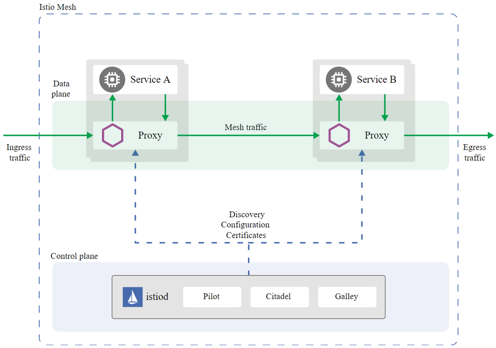

# Service Mesh
## 为什么提出Service Mesh
Spring Cloud 和 Dubbo都是侵入式的，比如语言只能限制在 Java，并且开发的时候要按框架的指定方式来开发。这个理念跟微服务的独立技术栈也是相反的。
Service Mesh是一种非侵入式技术，可以提供服务之间的网络调用、限流、熔断和服务监控等功能。Service Mesh 类似于 TCP/IP 协议，无需应用层感知，开发者只需要开发应用程序即可。所以，Service Mesh 是致力于解决服务间通讯的基础设施层。

## Service Mesh的几个特点：
- 应用程序间通讯的中间层。
- 轻量级网络代理。
- 非侵入式，应用程序无感知。
- 可以将服务治理功能，例如重试、超时、监控、链路追踪、服务发现等功能，以及服务本身解耦。

## Service开源项目
社区有很多优秀的 Service Mesh 开源项目，例如 Istio 、Linkerd 等。当前最受欢迎的开源项目是 Istio。

## istio
- Istio 是一个完全开源的服务网格，作为透明的一层接入到现有的分布式应用程序里，提供服务治理等功能。
- Istio 也是一个平台，拥有可以集成任何日志、遥测和策略系统的 API 接口。
- Istio 的大概实现原理是：每个服务都会被注入一个 Sidecar（边车）组件，服务之间通信是先通过 Sidecar，然后 Sidecar 再将流量转发给另一个服务。因为所有流量都经过一个 Sidecar，所以可以通过 Sidecar 实现很多功能，比如认证、限流、调用链等。同时还有一个控制面，控制面通过配置 Sidecar 来实现各种服务治理功能。

### istio组成
如图所示，Istio 主要包含两大平面。一个是数据平面（Data plane），由 Envoy Proxy 充当的 Sidecar 组成。另一个是控制平面（Control plane）istiod，主要由三大核心组件 Pilot、Citadel、Galley 组成。

- Pilot：主要用来管理部署在 Istio 服务网格中的 Envoy 代理实例，为它们提供服务发现、流量管理以及弹性功能，比如 A/B 测试、金丝雀发布、超时、重试、熔断等。
- Citadel：Istio 的核心安全组件，负责服务的密钥和数字证书管理，用于提供自动生成、分发、轮换及撤销密钥和数据证书的功能。
- Galley：负责向 Istio 的其他组件提供支撑功能，可以理解为 Istio 的配置中心，它用于校验进入网络配置信息的格式内容正确性，并将这些配置信息提供给 Pilot。