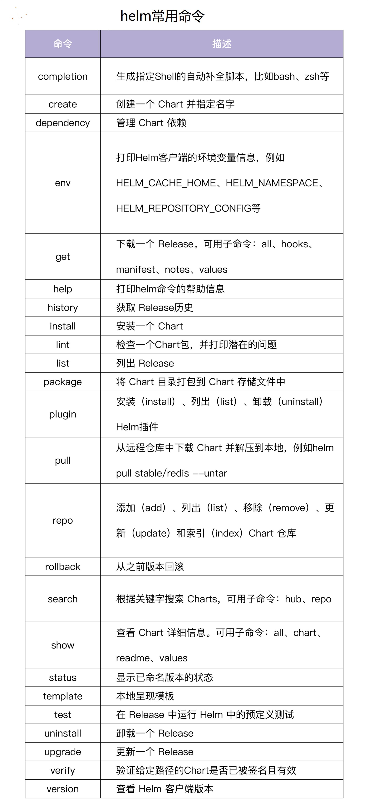

# Helm

## 1. Install

第一步，下载：
```
https://github.com/Helm/Helm/releases
```

第二步，解压
```
tart -xvf  xxx.tar
```

第三步 移动
```
mv <your_download_binary> /usr/local/bin/Helm
```
或者
```
$ mkdir -p $HOME/bin
$ wget https://get.helm.sh/helm-v3.6.3-linux-amd64.tar.gz
$ tar -xvzf helm-v3.6.3-linux-amd64.tar.gz
$ mv linux-amd64/helm $HOME/bin
$ chmod +x $HOME/bin/helm
$ helm version
version.BuildInfo{Version:"v3.6.3", GitCommit:"d506314abfb5d21419df8c7e7e68012379db2354", GitTreeState:"clean", GoVersion:"go1.16.5"}
```

安装完helm命令后，可以安装helm命令的自动补全脚本。假如你用的 shell 是bash，安装方法如下：
```
$ helm completion bash > $HOME/.helm-completion.bash
$ echo 'source $HOME/.helm-completion.bash' >> ~/.bashrc
$ bash
```

## 2. Intrduction
Helm 是 Kubernetes 的包管理器，类似于 Python 的 pip ，centos 的 yum 。
Helm 主要用来管理 Chart 包。
Helm Chart 包中包含一系列 YAML 格式的 Kubernetes 资源定义文件，以及这些资源的配置，可以通过 Helm Chart 包来整体维护这些资源。

Helm 目前是 Kubernetes 服务编排事实上的标准。
Helm 提供了多种功能来支持 Kubernetes 的服务编排，例如 Helm 命令行工具、Chart 包、Chart 仓库等

### Helm解决了什么痛点？
在 Kubernetes中部署一个可以使用的应用，需要涉及到很多的 Kubernetes 资源的共同协作。
比如你安装一个 WordPress 博客，用到了一些 Kubernetes (下面全部简称k8s)的一些资源对象，
包括 Deployment 用于部署应用、Service 提供服务发现、Secret 配置 WordPress 的用户名和密码，
可能还需要 pv 和 pvc 来提供持久化服务。并且 WordPress 数据是存储在mariadb里面的
，所以需要 mariadb 启动就绪后才能启动 WordPress。

这些 k8s 资源过于分散，不方便进行管理。

通过 Helm Chart 包来管理这些 Kubernetes 文件，并通过Helm命令，基于 Chart 包来创建和管理应用。

### Helm v3
- Helm 最新的版本是 v3，Helm3 以 Helm2 的核心功能为基础，对 Chart repo、发行版管理、安全性和 library Charts 进行了改进。
- 和 Helm2 比起来，Helm3 最明显的变化是删除了 Tiller（Helm2 是一种 Client-Server 结构，客户端称为 Helm，服务器称为 Tiller）。
- Helm3 还新增了一些功能，并废弃或重构了 Helm2 的部分功能，与 Helm2 不再兼容。
- 此外，Helm3 还引入了一些新的实验功能，包括 OCI 支持。

## 3. Helm架构

核心是 Helm Client（helm命令）和 Helm Chart 包。helm命令可以从Chart Repository中下载 Helm Chart 包，读取kubeconfig文件，并构建 kube-apiserver REST API 接口的 HTTP 请求。通过调用 Kubernetes 提供的 REST API 接口，将 Chart 包中包含的所有以 YAML 格式定义的 Kubernetes 资源，在 Kubernetes 集群中创建。

这些资源以 Release 的形式存在于 Kubernetes 集群中，每个 Release 又包含多个 Kubernetes 资源，例如 Deployment、Pod、Service 等。

## 4. Helm 组成
### 三个基本概念
- Chart：代表一个 Helm 包。它包含了在 Kubernetes 集群中运行应用程序、工具或服务所需的，所有 YAML 格式的资源定义文件。
- Repository（仓库）：它是用来存放和共享 Helm Chart 的地方，类似于存放源码的 GitHub 的 Repository，以及存放镜像的 Docker 的 Repository。
- Release：它是运行在 Kubernetes 集群中的 Chart 的实例。一个 Chart 通常可以在同一个集群中安装多次。每一次安装都会创建一个新的 Release。

### 两类文件
在 Helm 中，可以理解为主要包含两类文件：模板文件和配置文件。模板文件通常有多个，配置文件通常有一个。Helm 的模板文件基于text/template模板文件，提供了更加强大的模板渲染能力。Helm 可以将配置文件中的值渲染进模板文件中，最终生成一个可以部署的 Kubernetes YAML 格式的资源定义文件。

Chart 模板一个应用只用编写一次，可以重复使用。在部署时，可以指定不同的配置，从而将应用部署在不同的环境中，或者在同一环境中部署不同配置的应用。

## 5. 复用已有的Helm release
### 1) 操作Helm release repo
```
helm repo add bitnami https://charts.bitnami.com/bitnami
helm repo update
helm repo list
helm search repo grafana
```
添加(add)完成后，我们可以通过helm search命令，来查询需要的 Chart 包。

helm search支持两种不同的查询方式:
- helm search repo<keyword>：从你使用 helm repo add 添加到本地 Helm 客户端中的仓库里查找。该命令基于本地数据进行搜索，无需连接外网。
- helm search hub<keyword>：从 Artifact Hub 中查找并列出 Helm Charts。 Artifact Hub 中存放了大量的仓库。


### 2) 从remote repo安装Helm chart
```
helm upgrade --install loki bitnami/grafana-loki
```
安装完之后，你可以使用 helm status 来追踪 Release 的状态。

### 3) 本地安装Helm chart
```
helm pull bitnami/grafana-loki
helm upgrade --install loki ./loki-stack
```
也可以使用helm install进行安装。

helm install命令会将 templates 渲染成最终的 Kubernetes 能够识别的 YAML 格式，然后安装到 Kubernetes 集群中。
```
$ helm repo add bitnami https://charts.bitnami.com/bitnami # 添加 Chart Repository
$ helm repo list # 查看添加的 Repository 列表
$ helm install bitnami/mysql --generate-name
```
-generate-name参数告诉 Helm 自动为这个 Release 命名

### 4) 安装自定义Chart
上一步中的安装方式只会使用 Chart 的默认配置选项，很多时候我们需要自定义 Chart 来指定我们想要的配置。使用 helm show values 可以查看 Chart 中的可配置选项:
```
$ helm show values bitnami/mysql # 为了方便展示，我删除了 `helm show values`输出中的`#`注释
# ... and many more
architecture: standalone
auth:
  rootPassword: ""
  database: my_database
  username: ""
  password: ""
  replicationUser: replicator
  replicationPassword: ""
  existingSecret: ""
  forcePassword: false
  usePasswordFiles: false
  customPasswordFiles: {}
initdbScripts: {}
# ... and many more
```
然后，你可以使用 YAML 格式的文件，覆盖上述任意配置项，并在安装过程中使用该文件:
```
$ echo '{auth.database: iam, auth.username: iam, auth.password: iam59!z$}' > values.yaml
$ helm install bitnami/mysql -f values.yaml --generate-name
```
上述命令将为 MySQL 创建一个名称为 iam 的默认用户，密码为iam59!z$，并且授予该用户访问新建的 iam 数据库的权限。Chart 中的其他默认配置保持不变。

安装过程中，有两种传递配置数据的方式:
- -f, --values：使用 YAML 文件覆盖配置。可以指定多次，优先使用最右边的文件。
- --set：通过命令行的方式对指定配置项进行覆盖。

如果同时使用两种方式，则 --set 中的值会被合并到 --values 中，但是 --set 中的值优先级更高。在--set中覆盖的内容会被保存在 ConfigMap 中。你可以通过 helm get values <release-name> 来查看指定 Release 中 --set 设置的值，也可以通过运行 helm upgrade 并指定 --reset-values 字段，来清除 --set中设置的值。

### 5）升级应用
部署完应用之后，后续还可能升级应用，可以通过helm upgrade命令来升级应用
```
$ helm upgrade mysql-1629528555 bitnami/mysql --set auth.rootPassword='iam59!z$'
```
上面的例子中，mysql-1629528555 这个 Release 使用相同的 Chart 进行升级，但使用了一个新的rootPassword配置。

可以通过helm list查看有哪些Release。

使用 helm get values 命令，来看看配置值是否真的生效了：
```
$ helm get values mysql-1629528555
USER-SUPPLIED VALUES:
auth:
  rootPassword: iam59!z$
```

### 6) 回滚
假如发布失败，我们也很容易通过 helm rollback [RELEASE] [REVISION] 命令，回滚到之前的发布版本。
```
$ helm rollback mysql-1629528555 1
```
每当发生了一次安装、升级或回滚操作，revision 的值就会加1。第一次 revision 的值永远是1。

我们可以使用 helm history [RELEASE] 命令来查看一个特定 Release 的修订版本号。

### 7）卸载
你可以使用helm uninstall命令卸载一个 Release。

## 6. 开发自己的Helm chart
```
[root@kube-master first-Helm-char]# helm create myapp
Creating myapp
[root@kube-master first-Helm-char]# cd myapp
[root@kube-master myapp]# ls
charts  Chart.yaml  templates  values.yaml
```

- Chart.yaml 包含了chart信息的yaml文件
- values.yaml chart默认配置
- charts/ 包含chart依赖的其它chart
- templates/ 模板目录，和values.yaml结合时，可生成kubernates的manifest文件。


## 7. helm常用命令
如果你想查看 Helm 提供的所有命令，可以执行helm help。或者，你也可以执行helm <subcommand> -h来查看某个子命令的用法。常用命令如下：


## 参考资料
- https://helm.sh/zh/docs/intro/using_helm/
- https://time.geekbang.org/column/article/420940